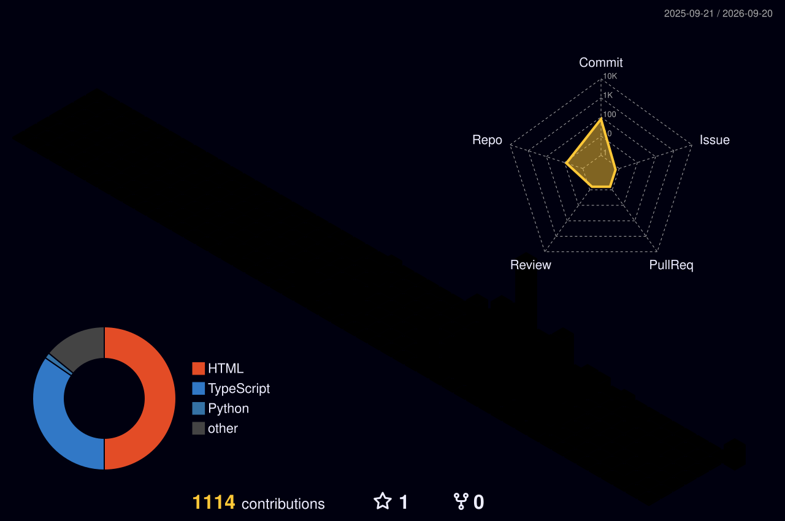

<div align="center">

<!-- HEADER SVG - Clean, minimal, portfolio style -->


<!-- Name + Role - Clean typography, no emojis -->
<br/>

```
▓▓▓▓▓▓▓▓▓▓▓▓▓▓▓▓▓▓▓▓▓▓▓▓▓▓▓▓▓▓▓▓▓▓▓▓▓▓▓▓▓▓▓▓▓▓▓▓▓▓▓▓▓▓▓▓
```

# Poras Nagar

**AI Engineer · Full-Stack Developer**  
Building production AI systems and scalable web platforms.

```
▓▓▓▓▓▓▓▓▓▓▓▓▓▓▓▓▓▓▓▓▓▓▓▓▓▓▓▓▓▓▓▓▓▓▓▓▓▓▓▓▓▓▓▓▓▓▓▓▓▓▓▓▓▓▓▓
```

<p>
  <a href="https://linkedin.com/in/porasnagar">LinkedIn</a> &nbsp;·&nbsp;
  <a href="mailto:poras9868@gmail.com">Email</a> &nbsp;·&nbsp;
  <a href="https://unlistedstox.com">UnlistedStox.com</a> &nbsp;·&nbsp;
  <a href="https://github.com/porasnagar">GitHub</a>
</p>


</div>

---

## Work

**EnxtAI** — AI Engineer & Full-Stack Developer *(2024 – Present)*

Building AI-powered SaaS products. Leading end-to-end development from architecture to production deployment. Working with agentic AI systems, LLM integrations, and high-throughput backend infrastructure.

**Flukesys Global** — Research & Data Analysis Intern *(2023)*

Data analysis and experimental validation in R&D. Worked with structured datasets to derive actionable insights for product decisions.

---

## Selected Projects

**[UnlistedStox](https://unlistedstox.com)** — Full-Stack · AI  
Unlisted equity trading platform. AI-powered stock analytics, real-time pricing, and portfolio management. React · Node.js · PostgreSQL.

**Hospital Management System** — Full-Stack · Integrations  
End-to-end hospital workflow automation with WhatsApp-native patient communication. Appointment scheduling, patient records, billing. Node.js · Meta WhatsApp Business API · MongoDB.

**Intelligent Scrapers** — Backend · AI  
Production data extraction pipelines for market intelligence. Async job queuing, retry logic, structured output. Python · Redis · RabbitMQ · Scrapy.

**AI Analytics Suite** — AI/ML · Backend  
LLM-driven business intelligence tools. Natural language querying over structured data, automated report generation. Python · TensorFlow · OpenAI APIs.

---

## Stack

```
Languages       Python  ·  TypeScript  ·  JavaScript
Frontend        React   ·  Next.js     ·  CSS
Backend         Node.js ·  Flask       ·  Express
AI/ML           TensorFlow · scikit-learn · OpenCV
Databases       PostgreSQL · MongoDB   ·  MySQL
Infra           Docker  ·  GitHub Actions · Redis · RabbitMQ
Integrations    Meta WhatsApp API · Google Stitch
```

---

## Stats

<div align="center">


&nbsp;&nbsp;


</div>

<div align="center">

</div>

---

## Contributions — 3D View

<div align="center">
  <picture>
    <source media="(prefers-color-scheme: dark)"  srcset="./profile-3d-contrib/profile-night-rainbow.svg" />
    <source media="(prefers-color-scheme: light)" srcset="./profile-3d-contrib/profile-season.svg" />
    
  </picture>
</div>

---

## Contribution Activity

<div align="center">
  <picture>
    <source media="(prefers-color-scheme: dark)"  srcset="https://raw.githubusercontent.com/porasnagar/porasnagar/output/github-contribution-grid-snake-dark.svg" />
    <source media="(prefers-color-scheme: light)" srcset="https://raw.githubusercontent.com/porasnagar/porasnagar/output/github-contribution-grid-snake.svg" />
    
  </picture>
</div>

---

<div align="center">
  <sub>B.Tech CSE · Hons. AI & Machine Learning · Amity University, Noida · 2021–2025</sub>
  <br/>
  <sub>Open to AI Engineer and Full-Stack opportunities · Remote / Hybrid / Noida</sub>
</div>
