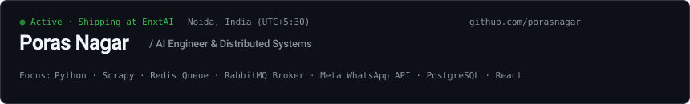

  <a href="https://porasnagar.github.io"><strong>Website (porasnagar.github.io)</strong></a> &nbsp;·&nbsp;
  <a href="https://unlistedstox.com"><strong>UnlistedStox.com</strong></a> &nbsp;·&nbsp;
  <a href="https://linkedin.com/in/poras-nagar-036886189"><strong>LinkedIn</strong></a> &nbsp;·&nbsp;
  <a href="mailto:poras9868@gmail.com"><strong>Email</strong></a>

---

### Overview

I am an AI Engineer at **EnxtAI** in Noida, India, with a B.Tech in Computer Science and Engineering (specializing in Artificial Intelligence and Machine Learning) from Amity University (2021–2025).

My core work centers on backend systems, data pipelines, and machine learning infrastructure:
* Designing pricing and valuation engines for pre-IPO unlisted equities at **UnlistedStox.com**.
* Implementing asynchronous webhook listeners and messaging flows over the **Meta WhatsApp Business Cloud API** for healthcare triage and appointment booking.
* Operating distributed web scraping clusters using **Python Scrapy**, **Redis** atomic sets for deduplication, and **RabbitMQ** message brokers for decoupled database ingestion.
* Maintaining internal agentic workflows using **Google Stitch**, **Antigravity**, **Hermes**, and **GitHub Actions** CI/CD pipelines.

---

### Production Systems

#### 1. UnlistedStox ([unlistedstox.com](https://unlistedstox.com))
*OTC Equity Valuation and Real-Time Pricing Engine*

* **Problem:** Unlisted Indian equity transactions happen off-exchange with fragmented liquidity, opaque bid/ask spreads, and delayed pricing data.
* **Architecture:** 
  * Node.js and Express REST services ingest dealer transactions, trade confirmations, and registrar filings.
  * A Python worker evaluates historical funding rounds, cap-table structures, and transaction filings to calculate fair valuation estimates.
  * Time-series price and volume records are stored in PostgreSQL with indexed B-tree lookups on ticker symbols and timestamp windows for fast chart queries.
  * A React interface displays live bid/ask spreads, liquidity indicators, and historical transactions.
* **Stack:** Python, TensorFlow, React, Node.js, Express, PostgreSQL, FastAPI.

#### 2. Hospital Management WhatsApp Integration
*Meta WhatsApp Cloud API Webhook Service and Automated Patient Triage*

* **Problem:** Manual hospital desk reception created phone bottlenecks for slot booking, report collection, and routine inquiries.
* **Architecture:**
  * Express.js webhook listener verifying Meta `X-Hub-Signature-256` HMAC signatures on every incoming message payload.
  * Sub-200ms acknowledgement response SLA to Meta servers to prevent automatic message retries.
  * Asynchronous dispatcher routing incoming patient intents (appointment booking, doctor slot queries, prescription verification, lab test lookup).
  * MongoDB document store tracking patient schema, doctor availability schedules, and multi-step conversation states.
  * Automated generation and dispatch of encrypted pathology report URLs directly within the WhatsApp thread.
* **Stack:** Meta WhatsApp Business API, Node.js, Express, MongoDB, Webhooks, React.

#### 3. High-Throughput Financial Scrapers & Queue Broker
*Distributed Data Harvesting Cluster with Deduplication and Message Queues*

* **Problem:** Gathering continuous valuation sheets, financial filings, and registrar updates across dozens of target portals without IP throttling or data loss during traffic spikes.
* **Architecture:**
  * Multi-worker Python Scrapy daemon cluster containerized in Docker.
  * Redis in-memory cache running SHA-256 URL and content hashing for duplicate avoidance before request dispatch.
  * Sliding-window rate limiter per target domain to maintain strict request intervals.
  * Parsed JSON records are published to a RabbitMQ topic exchange with durable queues and dead-letter exchanges (DLX) to decouple scraping throughput from database write limits.
  * Clean records ingested into PostgreSQL for time-series analytics.
* **Throughput:** ~10,000+ extracted pages per minute across parallel worker containers.
* **Stack:** Python, Scrapy, Redis, RabbitMQ, PostgreSQL, Docker.

#### 4. Multi-Agent Development Tooling
*Internal Engineering Acceleration Suite at EnxtAI*

* **Architecture:** 
  * Utilizes Google Stitch for UI layout synthesis and structural scaffolding.
  * Antigravity runtime for autonomous multi-step planning loops, tool execution, and workspace verification.
  * Hermes messaging protocol for asynchronous communication between specialized agents.
  * Automated testing, linting, and Docker container builds managed through GitHub Actions workflows.
* **Stack:** Python, Google Stitch, Antigravity, Hermes, GitHub Actions, Docker.

---

### Technical Stack & Implementation Context

| Domain | Primary Technologies | Production Implementation Details |
| :--- | :--- | :--- |
| **Languages** | Python, TypeScript, JavaScript, SQL | Async scraping daemons, data analysis, REST APIs, frontend components. |
| **Machine Learning** | TensorFlow, Deep Learning, OpenCV | Valuation modeling, precedent transaction analysis, computer vision coursework. |
| **Distributed / Backend** | Redis, RabbitMQ, Node.js, Express, FastAPI | SHA-256 deduplication cache, sliding-window rate limiters, durable message broker queues. |
| **Databases** | PostgreSQL, MongoDB | Partitioned time-series equity records in Postgres; patient conversation states in MongoDB. |
| **APIs & Protocols** | Meta WhatsApp Business API, Webhooks, REST | HMAC-SHA256 signature verification, asynchronous webhook routing, payload normalization. |
| **Frontend** | React, Next.js, CSS | Responsive trading interface for UnlistedStox, analytics charts, documentation. |
| **DevOps & Infrastructure** | Docker, GitHub Actions, Linux | Worker daemon containerization, automated testing workflows, deployment scripts. |

---

### Career & Academic Background

* **AI Engineer & Full-Stack Developer** — **EnxtAI** *(2024 – Present)*  
  Noida, India. Lead backend and AI system development for UnlistedStox, hospital automation webhooks, and distributed data harvesting clusters.
* **Research & Data Analysis Intern** — **Flukesys Global** *(2023)*  
  Structured dataset processing and validation for internal experimental tooling.
* **B.Tech in Computer Science & Engineering (AI & Machine Learning)** — **Amity University, Noida** *(2021 – 2025)*  
  Coursework in Neural Networks, Deep Learning, Computer Vision, Distributed Computing, Data Structures, and Database Management Systems.

---

### Contributions

  <picture>
    <source media="(prefers-color-scheme: dark)"  srcset="./profile-3d-contrib/profile-night-rainbow.svg" />
    <source media="(prefers-color-scheme: light)" srcset="./profile-3d-contrib/profile-season.svg" />
    
  </picture>

 

  Poras Nagar · AI Engineer @ EnxtAI · Noida, Uttar Pradesh, India 
  Email: <a href="mailto:poras9868@gmail.com">poras9868@gmail.com</a> · Website: <a href="https://porasnagar.github.io">porasnagar.github.io</a>

