<!--
  ══════════════════════════════════════════════════════════════
  porasnagar/porasnagar — Dual Retro OS Profile README
  Windows 98 Light Mode & 90s Phosphor CRT Dark Terminal
  Auto-updated via GitHub Actions CI Telemetry Pipeline
  ══════════════════════════════════════════════════════════════
-->

<!-- 1. HERO CONSOLE -->
<picture>
  <source media="(prefers-color-scheme: dark)"  srcset="assets/hero.svg">
  <source media="(prefers-color-scheme: light)" srcset="assets/hero-light.svg">
  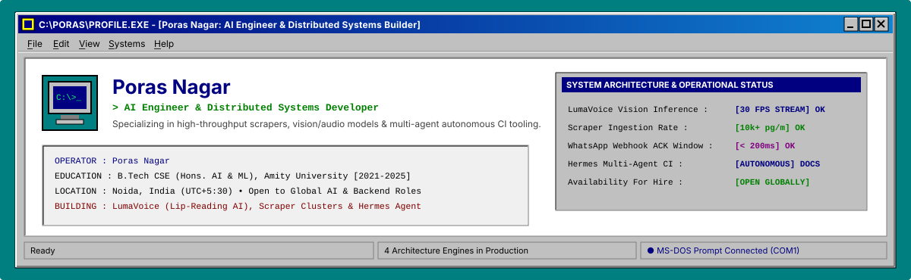
</picture>

<!-- 2. TASKBAR -->
<picture>
  <source media="(prefers-color-scheme: dark)"  srcset="assets/taskbar.svg">
  <source media="(prefers-color-scheme: light)" srcset="assets/taskbar-light.svg">
  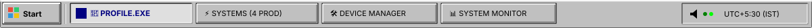
</picture>

<!-- 3. LIVE ENGINE TICKER (LOOPHOLE #19) -->
<picture>
  <source media="(prefers-color-scheme: dark)"  srcset="assets/ticker.svg">
  <source media="(prefers-color-scheme: light)" srcset="assets/ticker-light.svg">
  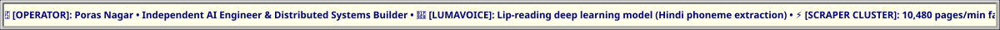
</picture>

<br>

<!-- 4. PHYSICAL KEYBOARD HOTKEYS TOOLBAR (LOOPHOLE #79) -->
<div align="center">

<a href="#systems"><kbd>Alt</kbd>+<kbd>S</kbd> <b>Systems.exe</b></a> &nbsp;│&nbsp;
<a href="#stack"><kbd>Alt</kbd>+<kbd>D</kbd> <b>Device_Manager.msc</b></a> &nbsp;│&nbsp;
<a href="#signals"><kbd>Alt</kbd>+<kbd>M</kbd> <b>Sys_Monitor.exe</b></a> &nbsp;│&nbsp;
<a href="#contact"><kbd>Alt</kbd>+<kbd>C</kbd> <b>Outlook_Express.exe</b></a> &nbsp;│&nbsp;
<a href="https://porasnagar.github.io" target="_blank"><kbd>Win</kbd>+<kbd>E</kbd> <b>Portfolio.url</b></a> &nbsp;│&nbsp;
<a href="https://linkedin.com/in/poras-nagar-036886189" target="_blank"><kbd>Ctrl</kbd>+<kbd>L</kbd> <b>LinkedIn.url</b></a>

</div>


<!-- ─────────────────────────── ABOUT ─────────────────────────── -->

I build the unglamorous half of AI products: the pricing engines, the queue
workers, the schemas that stop a scraper from lying to a trading screen.
Most of my work lives in Indian pre-IPO and unlisted equity markets, where the
data is messy, thinly traded, and nobody else has cleaned it up yet.

```yaml
operator:   Poras Nagar
role:       Full-Stack Developer & Product Manager  # @ EnxtAI / SMC Global Securities
domain:     fintech · unlisted & pre-IPO equities
education:  B.Tech CSE (Hons. AI & ML), Amity University — 2021→2025
timezone:   Asia/Kolkata (UTC+5:30)

currently:
  - shipping valuation + cap-table pipelines on UnlistedStox
  - leading a team of interns across four internal platforms
  - building Hermes, an agent that writes documents so I don't have to

open_to:  [ AI engineering, applied AI, backend-heavy full-stack ]
```


<!-- ─────────────────────────── SYSTEMS ─────────────────────────── -->
<a name="systems"></a>
<h3 align="center">Systems in Production</h3>
<p align="center"><sub>Four distributed production systems I'd be happy to be interviewed about line by line.</sub></p>

<table width="100%">
<tr>
<td width="50%" valign="top">

<a href="https://unlistedstox.com" target="_blank">
<picture>
  <source media="(prefers-color-scheme: dark)"  srcset="assets/card-unlistedstox.svg">
  <source media="(prefers-color-scheme: light)" srcset="assets/card-unlistedstox-light.svg">
  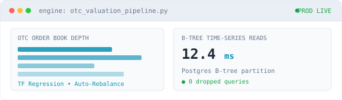
</picture>
</a>

<h4>UnlistedStox</h4>


<p>An OTC equity pricing and valuation platform. It turns historical
transactions, debt-to-equity metrics and statutory cap-table filings into
a live price for shares that never touch an exchange.</p>

<ul>
<li>Regression workers in Python/TensorFlow re-price on every new filing</li>
<li>B-tree indexed time-series in Postgres, sub-15&nbsp;ms reads</li>
<li>React order book rendering live bid/ask depth</li>
</ul>

<sub><code>Python</code> · <code>TensorFlow</code> · <code>React</code> · <code>Node</code> · <code>PostgreSQL</code></sub><br><br>
<a href="https://unlistedstox.com"><b>Open the platform →</b></a>

</td>
<td width="50%" valign="top">

<picture>
  <source media="(prefers-color-scheme: dark)"  srcset="assets/card-triage.svg">
  <source media="(prefers-color-scheme: light)" srcset="assets/card-triage-light.svg">
  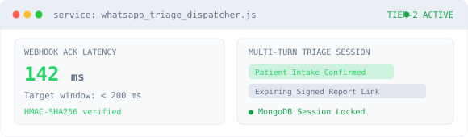
</picture>

<h4>Hospital triage over WhatsApp</h4>


<p>Patients book slots, submit intake and receive pathology reports without
leaving WhatsApp — no app install, which is the whole point in a tier-2
hospital's catchment area.</p>

<ul>
<li>Express webhook verifying HMAC-SHA256 inside a 200&nbsp;ms ack window</li>
<li>Async dispatcher holding multi-turn conversation state in MongoDB</li>
<li>Encrypted, expiring report URLs delivered in-thread</li>
</ul>

<sub><code>Meta WhatsApp API</code> · <code>Node</code> · <code>Express</code> · <code>MongoDB</code></sub>

</td>
</tr>
<tr>
<td width="50%" valign="top">

<picture>
  <source media="(prefers-color-scheme: dark)"  srcset="assets/card-scrapers.svg">
  <source media="(prefers-color-scheme: light)" srcset="assets/card-scrapers-light.svg">
  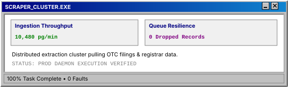
</picture>

<h4>Market scrapers &amp; queue broker</h4>


<p>The ingestion layer everything else sits on. A distributed extraction
cluster that pulls OTC valuations, filings and registrar data, then
normalises it into one schema before anything downstream sees it.</p>

<ul>
<li>Back-pressured fan-out with per-source rate budgets</li>
<li>Dead-letter replay so a bad parse never loses a day of data</li>
<li>Schema contracts enforced at the queue boundary, not in the consumer</li>
</ul>

<sub><code>Python</code> · <code>RabbitMQ</code> · <code>Redis</code> · <code>Docker</code></sub>

</td>
<td width="50%" valign="top">

<picture>
  <source media="(prefers-color-scheme: dark)"  srcset="assets/card-agents.svg">
  <source media="(prefers-color-scheme: light)" srcset="assets/card-agents-light.svg">
  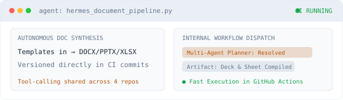
</picture>

<h4>Multi-agent internal tooling</h4>


<p>Agentic tooling deployed across our repos: it drafts documents, generates
decks and spreadsheets, and takes the repetitive half of engineering
paperwork off the team's plate.</p>

<ul>
<li>Deterministic document pipeline — templates in, DOCX/PPTX/XLSX out</li>
<li>Runs in CI, so artifacts are versioned alongside the code</li>
<li>Tool-calling layer shared across four internal platforms</li>
</ul>

<sub><code>Python</code> · <code>FastAPI</code> · <code>GitHub Actions</code></sub>

</td>
</tr>
</table>


<!-- ─────────────────────────── STACK ─────────────────────────── -->
<a name="stack"></a>
<h3 align="center">Runtime Stack &amp; Installed Drivers</h3>
<p align="center"><sub>Organized by system layer and active production runtimes.</sub></p>

<picture>
  <source media="(prefers-color-scheme: dark)"  srcset="assets/stack.svg">
  <source media="(prefers-color-scheme: light)" srcset="assets/stack-light.svg">
  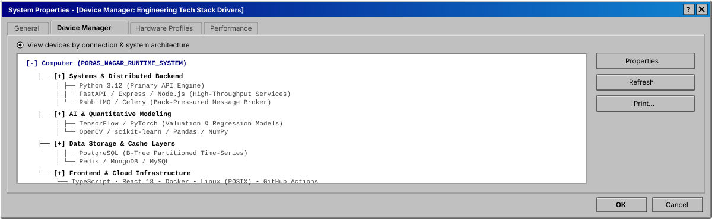
</picture>

<br><br>

<details>
<summary><b>&nbsp;Expand Complete Driver Registry</b></summary>
<br>
<div align="center">

<table width="100%">
<tr>
<td align="right" width="26%"><sub><b>AI &amp; ML Models</b></sub></td>
<td>


</td>
</tr>
<tr>
<td align="right"><sub><b>Backend &amp; Queues</b></sub></td>
<td>


</td>
</tr>
<tr>
<td align="right"><sub><b>Databases</b></sub></td>
<td>


</td>
</tr>
<tr>
<td align="right"><sub><b>Infrastructure</b></sub></td>
<td>


</td>
</tr>
</table>

</div>
</details>


<!-- ─────────────────────────── SIGNALS ─────────────────────────── -->
<a name="signals"></a>
<h3 align="center">System Telemetry &amp; Resource Monitor</h3>
<p align="center"><sub>Live telemetry stream refreshed automatically via GitHub Actions CI.</sub></p>

<picture>
  <source media="(prefers-color-scheme: dark)"  srcset="assets/signals.svg">
  <source media="(prefers-color-scheme: light)" srcset="assets/signals-light.svg">
  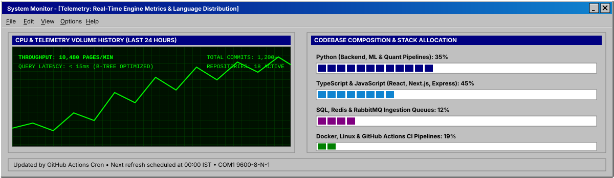
</picture>

<br>

<details open>
<summary><b>&nbsp;Disk Defragmenter / Contribution Calendar (3D)</b></summary>
<br>
<picture>
  <source media="(prefers-color-scheme: dark)"  srcset="profile-3d-contrib/profile-night-rainbow.svg">
  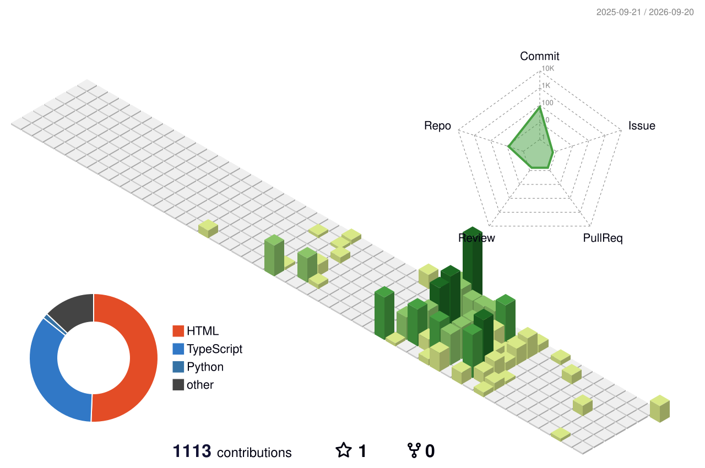
</picture>
</details>

<details>
<summary><b>&nbsp;Snake Eats the Cluster Sectors</b></summary>
<br>
<picture>
  <source media="(prefers-color-scheme: dark)"  srcset="https://raw.githubusercontent.com/porasnagar/porasnagar/output/github-snake-dark.svg">
  <source media="(prefers-color-scheme: light)" srcset="https://raw.githubusercontent.com/porasnagar/porasnagar/output/github-snake.svg">
  
</picture>
</details>


<!-- ─────────────────────────── CONTACT ─────────────────────────── -->
<a name="contact"></a>
<h3 align="center">Outlook Express 5.0 - Contact Console</h3>

<a href="mailto:poras9868@gmail.com">
<picture>
  <source media="(prefers-color-scheme: dark)"  srcset="assets/contact.svg">
  <source media="(prefers-color-scheme: light)" srcset="assets/contact-light.svg">
  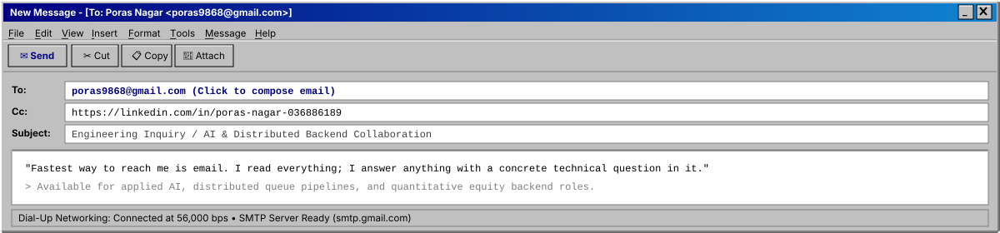
</picture>
</a>

<br><br>

<div align="center">

<a href="mailto:poras9868@gmail.com"></a>
<a href="https://linkedin.com/in/poras-nagar-036886189" target="_blank"></a>
<a href="https://porasnagar.github.io" target="_blank"></a>

<br><br>
<sub>Dual Retro OS Architecture (Microsoft Windows 98 Light Mode &amp; 90s Phosphor CRT Dark Mode) • Auto-updated via GitHub Actions.</sub>

</div>