<!--
  ══════════════════════════════════════════════════════════════
  porasnagar/porasnagar — profile README
  Every place you need to change something is marked  ✎
  Nothing here needs CSS: all styling lives inside assets/*.svg
  ══════════════════════════════════════════════════════════════
-->

<!-- ✎ HERO — edit the text inside assets/hero.svg AND assets/hero-light.svg -->
<picture>
  <source media="(prefers-color-scheme: dark)"  srcset="assets/hero.svg">
  <source media="(prefers-color-scheme: light)" srcset="assets/hero-light.svg">
  
</picture>

<!-- ─────────────────────────── NAV ─────────────────────────── -->
<div align="center">

<a href="#systems"></a>
<a href="#stack"></a>
<a href="#signals"></a>
<a href="#contact"></a>

<!-- ✎ your three real links -->
<a href="https://porasnagar.github.io"></a>
<a href="https://unlistedstox.com"></a>
<a href="https://linkedin.com/in/poras-nagar-036886189"></a>

</div>


<!-- ─────────────────────────── ABOUT ─────────────────────────── -->

I build the unglamorous half of AI products: the pricing engines, the queue
workers, the schemas that stop a scraper from lying to a trading screen.
Most of my work lives in Indian pre-IPO and unlisted equity markets, where the
data is messy, thinly traded, and nobody else has cleaned it up yet.

<!-- ✎ swap any of these values -->
```yaml
operator:   Poras Nagar
role:       Full-Stack Developer & Product Manager  # @ EnxtAI / SMC Global Securities
domain:     fintech · unlisted & pre-IPO equities
education:  B.Tech CSE (Hons. AI & ML), Amity University — 2021→2025
timezone:   Asia/Kolkata (UTC+5:30)

currently:
  - shipping valuation + cap-table pipelines on UnlistedStox
  - leading a team of interns across four internal platforms
  - building Hermes, an agent that writes documents so I don't have to

open_to:  [ AI engineering, applied AI, backend-heavy full-stack ]
```


<!-- ─────────────────────────── SYSTEMS ─────────────────────────── -->
<a name="systems"></a>
<h3 align="center">Systems in production</h3>
<p align="center"><sub>Four things I'd be happy to be interviewed about line by line.</sub></p>

<!-- ✎ replace cards freely — keep the 2×2 shape, it reads best on mobile -->
<table width="100%">
<tr>
<td width="50%" valign="top">

<h4>UnlistedStox</h4>


<p>An OTC equity pricing and valuation platform. It turns historical
transactions, debt-to-equity metrics and statutory cap-table filings into
a live price for shares that never touch an exchange.</p>

<ul>
<li>Regression workers in Python/TensorFlow re-price on every new filing</li>
<li>B-tree indexed time-series in Postgres, sub-15&nbsp;ms reads</li>
<li>React order book rendering live bid/ask depth</li>
</ul>

<sub><code>Python</code> · <code>TensorFlow</code> · <code>React</code> · <code>Node</code> · <code>PostgreSQL</code></sub><br><br>
<a href="https://unlistedstox.com"><b>Open the platform →</b></a>

</td>
<td width="50%" valign="top">

<h4>Hospital triage over WhatsApp</h4>


<p>Patients book slots, submit intake and receive pathology reports without
leaving WhatsApp — no app install, which is the whole point in a tier-2
hospital's catchment area.</p>

<ul>
<li>Express webhook verifying HMAC-SHA256 inside a 200&nbsp;ms ack window</li>
<li>Async dispatcher holding multi-turn conversation state in MongoDB</li>
<li>Encrypted, expiring report URLs delivered in-thread</li>
</ul>

<sub><code>Meta WhatsApp API</code> · <code>Node</code> · <code>Express</code> · <code>MongoDB</code></sub>

</td>
</tr>
<tr>
<td width="50%" valign="top">

<h4>Market scrapers &amp; queue broker</h4>


<p>The ingestion layer everything else sits on. A distributed extraction
cluster that pulls OTC valuations, filings and registrar data, then
normalises it into one schema before anything downstream sees it.</p>

<ul>
<li>Back-pressured fan-out with per-source rate budgets</li>
<li>Dead-letter replay so a bad parse never loses a day of data</li>
<li>Schema contracts enforced at the queue boundary, not in the consumer</li>
</ul>

<sub><code>Python</code> · <code>RabbitMQ</code> · <code>Redis</code> · <code>Docker</code></sub>

</td>
<td width="50%" valign="top">

<h4>Multi-agent internal tooling</h4>


<p>Agentic tooling deployed across our repos: it drafts documents, generates
decks and spreadsheets, and takes the repetitive half of engineering
paperwork off the team's plate.</p>

<ul>
<li>Deterministic document pipeline — templates in, DOCX/PPTX/XLSX out</li>
<li>Runs in CI, so artifacts are versioned alongside the code</li>
<li>Tool-calling layer shared across four internal platforms</li>
</ul>

<sub><code>Python</code> · <code>FastAPI</code> · <code>GitHub Actions</code></sub>

</td>
</tr>
</table>


<!-- ─────────────────────────── STACK ─────────────────────────── -->
<a name="stack"></a>
<h3 align="center">Stack</h3>
<p align="center"><sub>Grouped by what I reach for, not by what I've read about.</sub></p>

<div align="center">

<!-- ✎ the daily-drivers row stays open; everything else is collapsed -->


</div>

<details>
<summary><b>&nbsp;Everything else, by layer</b></summary>
<br>
<div align="center">

<table width="100%">
<tr>
<td align="right" width="26%"><sub><b>AI / ML</b></sub></td>
<td>


</td>
</tr>
<tr>
<td align="right"><sub><b>Backend &amp; pipelines</b></sub></td>
<td>


</td>
</tr>
<tr>
<td align="right"><sub><b>Frontend</b></sub></td>
<td>


</td>
</tr>
<tr>
<td align="right"><sub><b>Data</b></sub></td>
<td>


</td>
</tr>
<tr>
<td align="right"><sub><b>Infra</b></sub></td>
<td>


</td>
</tr>
</table>

</div>
</details>


<!-- ─────────────────────────── SIGNALS ─────────────────────────── -->
<a name="signals"></a>
<h3 align="center">Signals</h3>

<div align="center">

<!-- ✎ change username= in all four URLs -->
<picture>
  <source media="(prefers-color-scheme: dark)"  srcset="https://github-readme-stats.vercel.app/api?username=porasnagar&show_icons=true&hide_border=true&include_all_commits=true&count_private=true&bg_color=00000000&title_color=7c5cff&icon_color=22d3ee&text_color=8b98ab&ring_color=f59e0b">
  
</picture>
<picture>
  <source media="(prefers-color-scheme: dark)"  srcset="https://github-readme-stats.vercel.app/api/top-langs/?username=porasnagar&layout=compact&hide_border=true&langs_count=8&bg_color=00000000&title_color=7c5cff&text_color=8b98ab">
  
</picture>

</div>

<details open>
<summary><b>&nbsp;Contribution calendar, in 3D</b></summary>
<br>
<!-- generated nightly by .github/workflows/profile-assets.yml -->
<picture>
  <source media="(prefers-color-scheme: dark)"  srcset="profile-3d-contrib/profile-night-rainbow.svg">
  
</picture>
</details>

<details>
<summary><b>&nbsp;The snake eats the graph</b></summary>
<br>
<picture>
  <source media="(prefers-color-scheme: dark)"  srcset="https://raw.githubusercontent.com/porasnagar/porasnagar/output/github-snake-dark.svg">
  <source media="(prefers-color-scheme: light)" srcset="https://raw.githubusercontent.com/porasnagar/porasnagar/output/github-snake.svg">
  
</picture>
</details>


<!-- ─────────────────────────── CONTACT ─────────────────────────── -->
<a name="contact"></a>
<h3 align="center">Say hello</h3>

<p align="center">
Fastest way to reach me is email. I read everything; I answer anything
with a concrete question in it.
</p>

<div align="center">

<!-- ✎ your handles -->
<a href="mailto:poras9868@gmail.com"></a>
<a href="https://linkedin.com/in/poras-nagar-036886189"></a>
<a href="https://porasnagar.github.io"></a>

<br><br>
<sub>Hero and dividers are hand-written SVG in <a href="assets/"><code>assets/</code></a> — no template, no generator.</sub>

</div>
